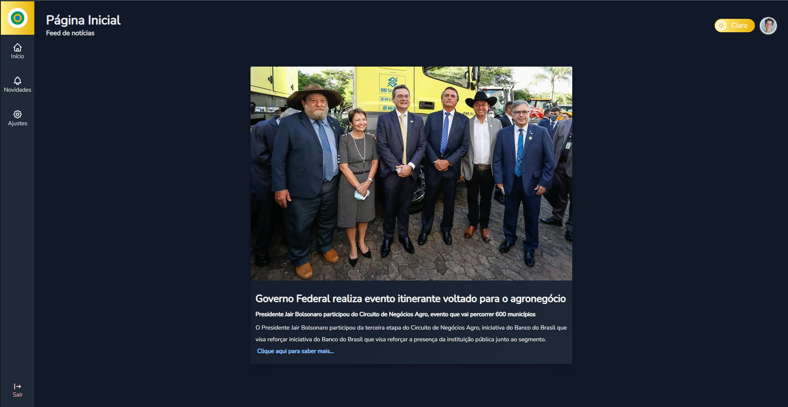

# Rede Brasil

### Sobre
Web-app consolidado com Next.JS e integrado ao TypeScript. A rede social funciona como uma espécie de "conjunto" de notícias sobre o governo brasileiro, com a finalidade de atualizar a população com notícias diárias.

### Tecnologias e Integrações
- JavaScript
- TypeScript
- CSS3
- React
- Next.js
- Tailwind CSS
- Google Firebase

### Uso e instalação
- Para instalar as dependências: Npm install
- É necessário criar um projeto no Google Firebase
- Referenciar o Auth domain, API key e Project Key em config.js 
